# Booking App Frontend

Modern hotel booking frontend built with React, TypeScript, TanStack Router, Tailwind CSS, and Vite. This repository is designed as a portfolio-ready product demo that showcases:

- feature-based frontend architecture
- typed routing, DTOs, and validated form flows
- reusable UI primitives and layouts
- lazy-loaded pages with loading skeletons
- polished booking, profile, and admin experiences
- clean API and session boundaries for scalable growth

## Overview

Booking App Frontend is a responsive travel and hospitality interface focused on the end-to-end booking journey, from discovery to checkout and trip management. The app is organized to feel like a production-ready frontend foundation rather than a collection of isolated pages.

The current implementation emphasizes:

- a feature-first structure for long-term maintainability
- typed route params, search params, DTOs, and form state
- route-based code splitting for faster perceived navigation
- consistent visual language powered by Tailwind CSS 4
- reusable shared layers for UI, API access, layouts, and session state
- a clear path for scaling into richer booking and admin workflows

## Demo Goals

This repo is meant to communicate engineering skill clearly in a hiring context:

- architecture thinking through feature boundaries, shared layers, and shell composition
- strong TypeScript fundamentals in routes, forms, DTOs, API helpers, and domain models
- frontend performance awareness through lazy loading and skeleton-driven loading states
- product sense through mobile-friendly layouts, hierarchy, and clearer interaction flows
- maintainability through small shared primitives, custom hooks, and schema-first form orchestration

## Tech Stack

### Core

- React 18
- TypeScript
- Vite
- TanStack Router
- React Hook Form
- Zod
- Tailwind CSS 4

### Supporting

- `clsx` for class composition
- `js-cookie` for cookie-backed session handling
- `@hookform/resolvers` for schema-driven form validation
- PostCSS for Tailwind integration
- Jest + Testing Library for unit and component testing

## Feature Overview

- Public browsing flow with home search, search results, hotel detail, and checkout
- Account flow with login, manager login, registration, verification, and password recovery
- User surface with booking history and profile management
- Admin surface with dashboard, booking management, property management, and property detail views

## Architecture

```text
src/
  app/        # router, providers, root shell, route boundaries, global styles
  features/   # feature-first modules with dto/hooks/components/routes
  shared/     # app-wide ui, api client, layouts, session, lib helpers, shared types
  types/      # ambient type declarations
legacy/
  cra-app/    # archived source tree kept outside the active runtime surface
```

### Active Feature Modules

- `auth`
  - login, manager login, registration, verification, forgot-password scaffold
- `home`
  - landing page and search entry flow
- `search`
  - typed search params, zod-backed search form, result listing
- `hotels`
  - hotel detail loader + booking draft flow
- `bookings`
  - checkout DTOs, split summary/form cards, final state, booking history
- `profile`
  - typed profile DTO, validated profile form, update flow
- `admin`
  - dashboard, manage bookings, manage properties, property detail, settings placeholders

## Routing Strategy

The app uses TanStack Router with:

- route-level lazy loading
- route loaders for page data
- loader dependencies for search-driven routes
- redirect-based auth guards
- centralized error and not-found boundaries

### Router Sketch

```mermaid
flowchart TD
  Root["Root Shell"]
  Public["Public Shell"]
  Admin["Admin Shell"]

  Root --> Public
  Root --> Admin

  Public --> Home["/"]
  Public --> Login["/login"]
  Public --> Register["/register"]
  Public --> Search["/searchresult"]
  Public --> Hotel["/hotelDetail/:hotelId"]
  Public --> Checkout["/checkout/:bookingId"]
  Public --> Profile["/profile"]
  Public --> History["/bookings-trips"]

  Admin --> Dashboard["/admin/managePage/dashboard"]
  Admin --> Bookings["/admin/managePage/manage-booking"]
  Admin --> Properties["/admin/managePage/manage-properties"]
  Admin --> PropertyDetail["/admin/managePage/manage-properties/:hotelId"]
  Admin --> Reviews["/admin/managePage/hotel-reviews"]
  Admin --> Accounts["/admin/managePage/manage-account"]
  Admin --> Settings["/admin/managePage/manage-settings"]
```



## UI Direction

The visual system is intentionally more editorial and product-focused than a default admin template:

- warm editorial palette instead of stock gray/purple SaaS visuals
- glass and surface layering to create depth without overusing effects
- strong card rhythm and rounded geometry for consistency
- cleaner text hierarchy with fewer competing accents
- responsive layouts that preserve readability on mobile and desktop

## Engineering Highlights

- route-based lazy loading
- typed route params and search params
- schema-first DTO and form validation with React Hook Form + Zod
- centralized HTTP helpers
- reusable session utilities
- shared UI primitives
- feature-based ownership
- scalable shared dependency graph

## What This Demo Emphasizes

If you are reviewing this repo as a hiring signal, the strongest parts to look at are:

- [src/app/router.tsx](src/app/router.tsx)
- [src/app/root-shell.tsx](src/app/root-shell.tsx)
- [src/shared/api/http.ts](src/shared/api/http.ts)
- [src/shared/session/session.ts](src/shared/session/session.ts)
- [src/features/search/routes/search-results-page.tsx](src/features/search/routes/search-results-page.tsx)
- [src/features/hotels/routes/hotel-detail-page.tsx](src/features/hotels/routes/hotel-detail-page.tsx)
- [src/features/bookings/routes/checkout-page.tsx](src/features/bookings/routes/checkout-page.tsx)
- [src/features/admin/routes/property-detail-page.tsx](src/features/admin/routes/property-detail-page.tsx)

These files show the architectural direction of the app especially well.

## Project Entry Points

The application boots from:

- `src/main.tsx`
- `src/app/styles/global.css`
- `src/app/providers.tsx`
- `src/app/router.tsx`

## Getting Started

### 1. Install dependencies

```bash
npm install
```

### 2. Configure environment variables

Copy `.env.example` to `.env` and update the API URL if needed:

```bash
cp .env.example .env
```

```env
VITE_API_BASE_URL=http://localhost:3002/api/v1
```

### 3. Run the app

```bash
npm run dev
```

Default local URL:

```text
http://localhost:3000
```

## Scripts

```bash
npm run dev
npm run build
npm run preview
npm run typecheck
npm run test
```

## Build Status

The project currently passes:

- `npm run typecheck`
- `npm run build`

## Suggested Resume Bullet Ideas

You can derive bullets like these from this repo:

- Built a hotel booking frontend with React, TypeScript, Vite, Tailwind CSS, and TanStack Router using a feature-based architecture.
- Implemented typed route loaders, DTO-driven form schemas, guarded routes, reusable UI primitives, and shared API/session layers to support scalable frontend development.
- Designed lazy-loaded booking and admin flows with skeleton states, extracted page hooks, and split components to improve perceived performance and maintainability.
- Created a portfolio-ready product demo that balances code quality, maintainability, and polished UI execution.

## Next Steps

Areas intentionally left open for further iteration:

- add richer mutation/cache orchestration
- expand admin settings/reviews/account features beyond placeholders
- add end-to-end and route-level integration tests for the new app surface

## License

MIT
