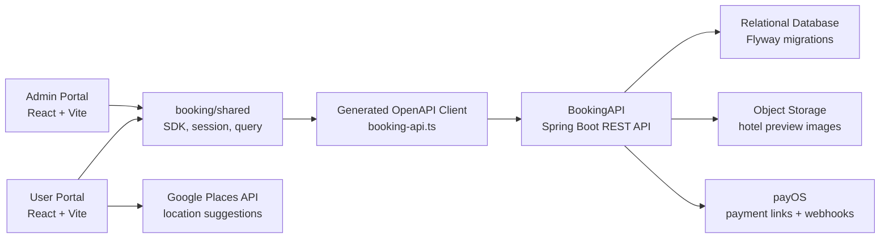
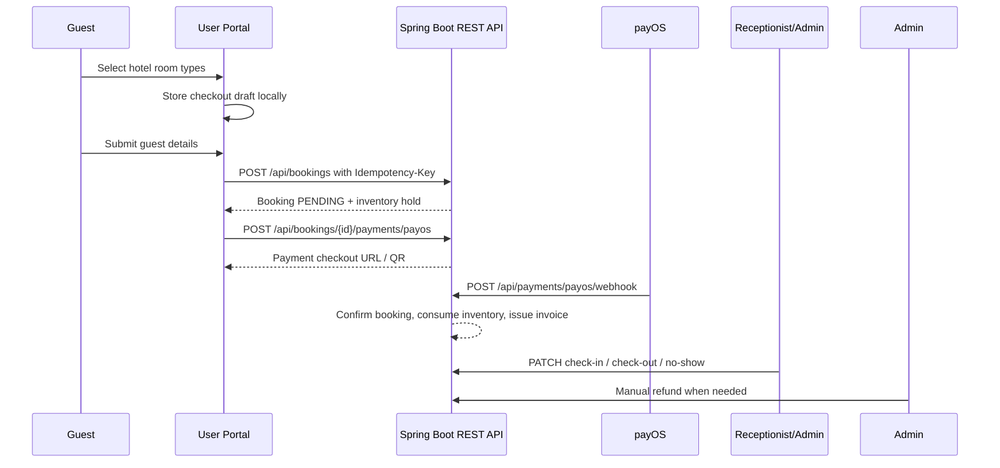

# Booking Monorepo

Frontend monorepo for a hotel booking product backed by the sibling `BookingAPI` Spring Boot REST API.
The frontend is split into two independent React applications:

- `user-portal`: customer-facing booking experience
- `admin-portal`: manager dashboard for bookings, properties, and settings

The repo uses Turborepo workspaces, shared API/session utilities, generated OpenAPI types, and a shared UI package so both apps can evolve independently without duplicating core infrastructure.

## Overview

The full local system is now:

- `booking-app`: this frontend monorepo
- `BookingAPI`: sibling backend repo implemented as a Spring Boot REST API
- Spring Boot exposes OpenAPI at `/v3/api-docs`; FE generated types live in `packages/shared/src/api/generated`
- Spring Boot handles auth, location-based hotel search, manager statistics, bookings, payOS payment links, invoices, refunds, receptionist assignments, hotel/room CRUD, taxes, discounts, cancellation policies, and reviews
- The user portal calls Google Places suggestions, stores the selected latitude/longitude in search params, then sends them to `POST /api/hotels/search`

Both portals use:

- React 18
- TypeScript
- Vite
- TanStack Router
- TanStack Query
- React Hook Form
- Zod
- Tailwind CSS 4

## Architecture





## Repository Structure

```text
.
├── apps
│   ├── admin-portal
│   │   ├── src
│   │   │   ├── app
│   │   │   ├── features
│   │   │   └── shared/layouts
│   │   ├── Dockerfile
│   │   ├── package.json
│   │   └── vite.config.ts
│   └── user-portal
│       ├── src
│       │   ├── app
│       │   ├── features
│       │   └── shared/layouts
│       ├── Dockerfile
│       ├── package.json
│       └── vite.config.ts
├── packages
│   ├── shared
│   │   └── src
│   │       ├── api
│   │       ├── lib
│   │       ├── query
│   │       ├── routes
│   │       ├── session
│   │       └── types
│   ├── tsconfig
│   └── ui
│       └── src
├── turbo.json
└── package.json
```

## Apps

### `apps/user-portal`

Customer booking surface with:

- home search and search results
- Google Places destination suggestions with latitude/longitude hotel search
- hotel detail and checkout
- account authentication and verification
- forgot-password OTP reset
- booking history, cancellation, reviews, payment links, and invoice display

Default local port: `3000`

### `apps/admin-portal`

Manager surface with:

- manager sign-in
- dashboard metrics from `/api/hotels/manager/stats`
- booking operations
- front-desk check-in, check-out, and no-show queues
- property management, hotel CRUD, room type/room/amenity management, and preview image upload
- review moderation through Spring Boot review endpoints
- discount, cancellation policy, tax config, receptionist assignment, invoice/payment/refund workflows
- manager account and portfolio access overview
- workspace settings persisted per device

Default local port: `3001`

## Packages

### `@booking/shared`

Shared business and infrastructure layer:

- Spring Boot OpenAPI client wrapper and typed SDKs
- query client setup
- session storage and guards
- domain types and API contracts
- reusable utilities such as formatters and booking query normalization

### `@booking/ui`

Reusable presentational primitives shared across both portals:

- `Button`
- `Card`
- `Field`
- `Input`
- `Select`
- `Textarea`
- `Skeleton`
- `PageSkeleton`
- `EmptyState`
- `ErrorState`

### `@booking/tsconfig`

Shared TypeScript base configs for workspace packages and React apps.

## Requirements

- Node.js `>= 22`
- npm `>= 10`

This repo is currently configured with:

- `packageManager: npm@11.6.2`

## Setup

Install everything once from the repository root:

```bash
npm install
```

Each app has its own `.env.example`:

- [apps/user-portal/.env.example](/Users/datle/work/study/BookingApp/booking-app/apps/user-portal/.env.example)
- [apps/admin-portal/.env.example](/Users/datle/work/study/BookingApp/booking-app/apps/admin-portal/.env.example)

Example:

```env
VITE_API_BASE_URL=http://localhost:8080
VITE_GOOGLE_MAPS_API_KEY=<google-maps-browser-key>
```

`VITE_API_BASE_URL` points to the Spring Boot `BookingAPI` REST API. `VITE_GOOGLE_MAPS_API_KEY` is used by the user portal for destination suggestions before sending latitude and longitude to the hotel search endpoint.

## Development Commands

Run both apps:

```bash
npm run dev
```

Run only the user portal:

```bash
npm run dev:user
```

Run only the admin portal:

```bash
npm run dev:admin
```

## Build And Typecheck

From the root:

```bash
npm run typecheck
npm run build
```

Run a task for a single app:

```bash
npx turbo run build --filter=user-portal
npx turbo run build --filter=admin-portal
npx turbo run typecheck --filter=user-portal
```

## Data Fetching Approach

The apps use a shared API-client pattern instead of ad-hoc fetch calls:

- `@booking/shared` owns Spring Boot SDK wrappers and typed API mappers
- `packages/shared/src/api/generated/booking-api.ts` is generated from `BookingAPI` OpenAPI `/v3/api-docs`
- route loaders prefetch data through `queryClient.ensureQueryData(...)`
- screens render from `useSuspenseQuery(...)`
- mutations use `useMutation(...)` with targeted invalidation
- search and filter state is normalized from the URL query layer
- hotel search posts latitude, longitude, dates, guest counts, room count, and keyword to `POST /api/hotels/search`

This keeps TanStack Router and TanStack Query aligned while avoiding app-specific data logic inside the shared transport layer.

Regenerate the OpenAPI client when `BookingAPI` changes:

```bash
npm run generate:dto
```

## Docker

Each app ships with its own Dockerfile:

- [apps/user-portal/Dockerfile](/Users/datle/work/study/BookingApp/booking-app/apps/user-portal/Dockerfile)
- [apps/admin-portal/Dockerfile](/Users/datle/work/study/BookingApp/booking-app/apps/admin-portal/Dockerfile)

Build a single app image from the repo root:

```bash
docker build -f apps/user-portal/Dockerfile .
docker build -f apps/admin-portal/Dockerfile .
```

## CI/CD

GitHub Actions now runs the monorepo pipeline defined in [/.github/workflows/npm-publish-github-packages.yml](/Users/datle/work/study/BookingApp/booking-app/.github/workflows/npm-publish-github-packages.yml):

- `npm ci`
- `npx turbo run typecheck`
- `npx turbo run test-unit -- --runInBand`
- `npx turbo run build`
- Docker build and push for `user-portal`
- Docker build and push for `admin-portal`

Required Docker secrets:

- `DOCKERHUB_USERNAME`
- `DOCKERHUB_PASSWORD`
- `DOCKERHUB_IMAGE_USER` (optional, defaults to `<DOCKERHUB_USERNAME>/booking-app-user-portal`)
- `DOCKERHUB_IMAGE_ADMIN` (optional, defaults to `<DOCKERHUB_USERNAME>/booking-app-admin-portal`)

## Adding A New App

1. Create `apps/<name>/package.json`, `tsconfig.json`, `vite.config.ts`, and `src/`.
2. Reuse shared dependencies from `@booking/shared` and UI primitives from `@booking/ui`.
3. Add app-specific routes under `src/app/router.tsx`.
4. Add Docker and environment files if the app needs deployment.
5. Verify with `npx turbo run typecheck --filter=<name>` and `npx turbo run build --filter=<name>`.

## Adding A New Package

1. Create `packages/<name>/package.json` and `tsconfig.json`.
2. Export a clean public API through `src/index.ts`.
3. Keep package responsibilities narrow so apps stay easy to compose.
4. Add scripts only when the package truly owns a task such as `typecheck`.

## Notes

- The old single-app root source has been retired in favor of workspace apps.
- Manager access intentionally lives in `admin-portal`, not in `user-portal`.
- Shared route guards redirect using plain `href` values so the package stays compatible with both route trees.
